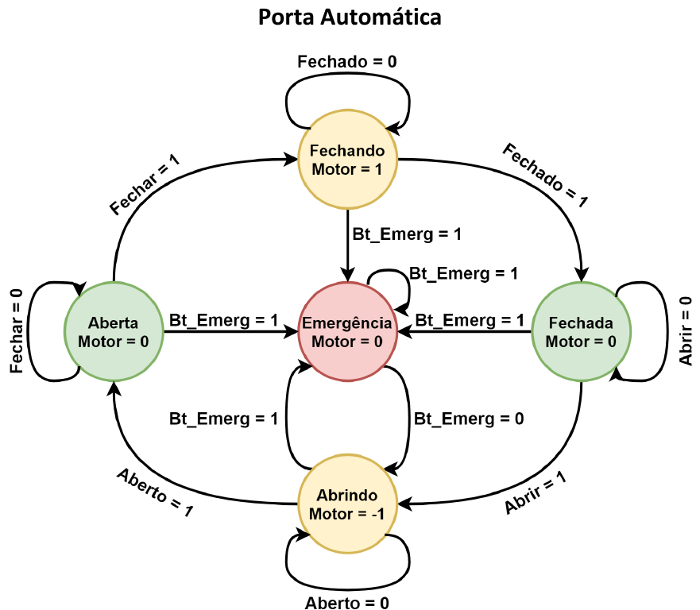
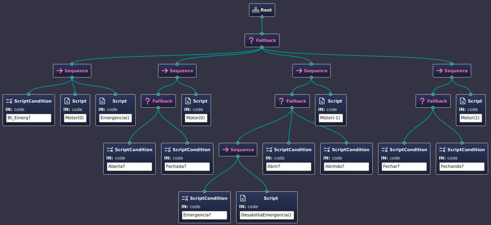

# Exemplo de modelagem com Behavior Tree
---

## Máquina de estados de uma aplicação de porta automática

A aplicação de uma porta automática é apresentada com a seguinte máquina de estados:

A partir desta máquina de estados foi desenvolvida uma *Behavior Tree* (BT) como forma de exercício para validar a transformação entre os formalismos.

## Convenções

Para traduzir as informações do diagrama da máquina de estados para a *Behavior Tree* foram utilizadas as seguintes convenções:

- Os estados `Aberta` e `Fechada` serão considerados como *condições* na BT. Na aplicação, estas condições podem ser provenientes da leitura de sensores que indiquem quando a porta está aberta ou fechada.
- As ações `Abrir` e `Fechar` também serão consideradas como *condições* na BT. Tais condições podem ser compreendidas como a ocorrência da ação no sistema.
- As ações relacionadas ao motor terão o seguinte significado na BT:
  - `Motor(0)`: para o motor e atribui o estado do motor como `Parado` (não representado na BT).
  - `Motor(1)`: ativa o motor para fechar a porta e atribui o estado da porta como `Fechando`.
  - `Motor(-1)`: ativa o motor para abrir a porta e atribui o estado da porta como `Abrindo`.
  - A execução da função `Motor(value)` é idempotente, não alterando o estado do sistema caso a mesma chamada seja executada múltiplas vezes.
- Os estados `Abrindo` e `Fechando` serão considerados como *condições* na BT. Estas condições são produzidas a partir da ocorrência da ação `Motor(valor)`, onde `valor` pode ser `-1`, `0` ou `1`.
- As condições verificadas na BT são representadas através do bloco `ScriptCondition`. O texto neste bloco está no formato `var_cond?`, o qual representa a verificação `if (var_cond) then TRUE else FALSE`.
- A ação `Emergencia()` na BT aciona a função de emergência do sistema e atribui o valor `TRUE` à condição `Emergencia`.
- A ação `DesabilitaEmergencia()` na BT foi adicionada com o intuito de limpar a condição de emergência. Assim, essa ação atribui o valor `FALSE` à condição `Emergencia`.

## Modelo em *Behavior Tree*

O modelo de BT apresentado tem como nó inicial um *fallback*. Neste nó de *fallback*  existem quatro possíveis ramificações, onde cada uma delas representa os seguintes cenários:

1. **Sistema em emergência**: independemente do momento e do estado que o sistema esteja, tão logo o botão de emergência é pressionado (`Bt_Emerg`), o sistema desativa o motor através da ação `Motor(0)` e coloca o sistema em emergência com a função `Emergencia()`.
2. **Sistema está com o motor parado**: quando o sistema verifica que a porta está aberta ou fechada, o motor é desativado através da ação `Motor(0)`.
3. **Sistema ativa o motor para abrir a porta**: caso ocorra uma ação para abrir a porta ou o motor já esteja ativado para abrir a porta, ou mesmo na ocorrência prévia de uma situação de emergência, o motor é ativado através da ação `Motor(-1)`.
4. **Sistema ativa o motor para fechar a porta**: caso ocorra uma ação para fechar a porta ou o motor já esteja ativado para fechar a porta, o motor é ativado através da ação `Motor(1)`.