# Scaling Analysis — BT Instances

All 30 BT instances used in the Phase 2 MILP scaling study, reconstructed from their random seeds. Organised by number of nodes **n**. Each instance is generated by `scripts/minla/random_bt.generate(n, seed)`.

> **Node type assignment:** control nodes (those with at least one child) are labelled **Sequence** or **Fallback** alternating in DFS pre-order. Leaf nodes are labelled A, B, C, … in left-to-right order.

---

## n = 5

### n=5 · seed=0

- **Nodes:** 5 &nbsp;|&nbsp; **Control:** 2 &nbsp;|&nbsp; **Leaves:** 3 &nbsp;|&nbsp; **Edges |E|:** 6 &nbsp;|&nbsp; **Binary vars:** 20

**Node array (LCRS fields):**

| Index | Type | Parent | Child | Sibling |
|-------|------|--------|-------|---------|
| `0` | Sequence | `—` | `1` | `—` |
| `1` | Fallback | `0` | `2` | `3` |
| `2` | Leaf A | `1` | `—` | `—` |
| `3` | Leaf B | `0` | `—` | `4` |
| `4` | Leaf C | `0` | `—` | `—` |

**Behavior tree:**

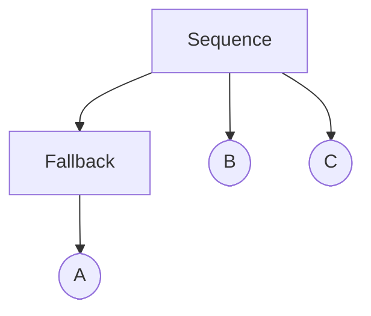

---

### n=5 · seed=1

- **Nodes:** 5 &nbsp;|&nbsp; **Control:** 1 &nbsp;|&nbsp; **Leaves:** 4 &nbsp;|&nbsp; **Edges |E|:** 7 &nbsp;|&nbsp; **Binary vars:** 20

**Node array (LCRS fields):**

| Index | Type | Parent | Child | Sibling |
|-------|------|--------|-------|---------|
| `0` | Sequence | `—` | `1` | `—` |
| `1` | Leaf A | `0` | `—` | `2` |
| `2` | Leaf B | `0` | `—` | `3` |
| `3` | Leaf C | `0` | `—` | `4` |
| `4` | Leaf D | `0` | `—` | `—` |

**Behavior tree:**

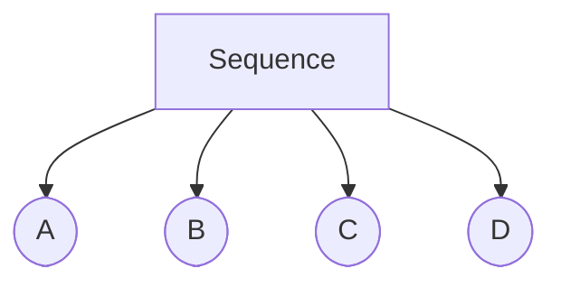

---

### n=5 · seed=2

- **Nodes:** 5 &nbsp;|&nbsp; **Control:** 2 &nbsp;|&nbsp; **Leaves:** 3 &nbsp;|&nbsp; **Edges |E|:** 6 &nbsp;|&nbsp; **Binary vars:** 20

**Node array (LCRS fields):**

| Index | Type | Parent | Child | Sibling |
|-------|------|--------|-------|---------|
| `0` | Sequence | `—` | `1` | `—` |
| `1` | Fallback | `0` | `2` | `4` |
| `2` | Leaf A | `1` | `—` | `3` |
| `3` | Leaf B | `1` | `—` | `—` |
| `4` | Leaf C | `0` | `—` | `—` |

**Behavior tree:**

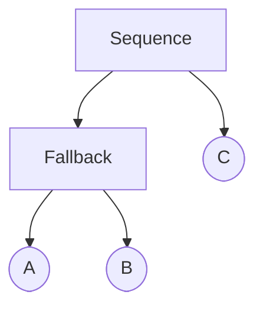

---

### n=5 · seed=3

- **Nodes:** 5 &nbsp;|&nbsp; **Control:** 1 &nbsp;|&nbsp; **Leaves:** 4 &nbsp;|&nbsp; **Edges |E|:** 7 &nbsp;|&nbsp; **Binary vars:** 20

**Node array (LCRS fields):**

| Index | Type | Parent | Child | Sibling |
|-------|------|--------|-------|---------|
| `0` | Sequence | `—` | `1` | `—` |
| `1` | Leaf A | `0` | `—` | `2` |
| `2` | Leaf B | `0` | `—` | `3` |
| `3` | Leaf C | `0` | `—` | `4` |
| `4` | Leaf D | `0` | `—` | `—` |

**Behavior tree:**

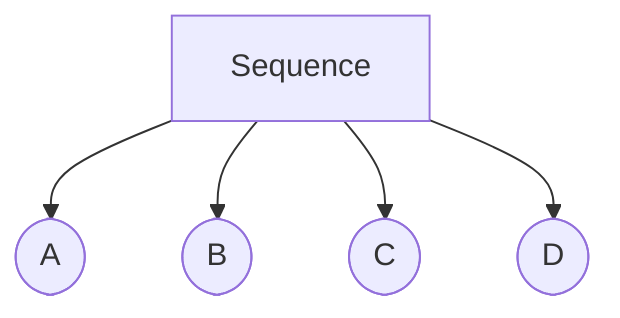

---

### n=5 · seed=4

- **Nodes:** 5 &nbsp;|&nbsp; **Control:** 2 &nbsp;|&nbsp; **Leaves:** 3 &nbsp;|&nbsp; **Edges |E|:** 6 &nbsp;|&nbsp; **Binary vars:** 20

**Node array (LCRS fields):**

| Index | Type | Parent | Child | Sibling |
|-------|------|--------|-------|---------|
| `0` | Sequence | `—` | `1` | `—` |
| `1` | Fallback | `0` | `2` | `3` |
| `2` | Leaf A | `1` | `—` | `—` |
| `3` | Leaf B | `0` | `—` | `4` |
| `4` | Leaf C | `0` | `—` | `—` |

**Behavior tree:**


---

## n = 8

### n=8 · seed=0

- **Nodes:** 8 &nbsp;|&nbsp; **Control:** 3 &nbsp;|&nbsp; **Leaves:** 5 &nbsp;|&nbsp; **Edges |E|:** 11 &nbsp;|&nbsp; **Binary vars:** 56

**Node array (LCRS fields):**

| Index | Type | Parent | Child | Sibling |
|-------|------|--------|-------|---------|
| `0` | Sequence | `—` | `1` | `—` |
| `1` | Fallback | `0` | `2` | `6` |
| `2` | Leaf A | `1` | `—` | `3` |
| `3` | Leaf B | `1` | `—` | `4` |
| `4` | Sequence | `1` | `5` | `—` |
| `5` | Leaf C | `4` | `—` | `—` |
| `6` | Leaf D | `0` | `—` | `7` |
| `7` | Leaf E | `0` | `—` | `—` |

**Behavior tree:**

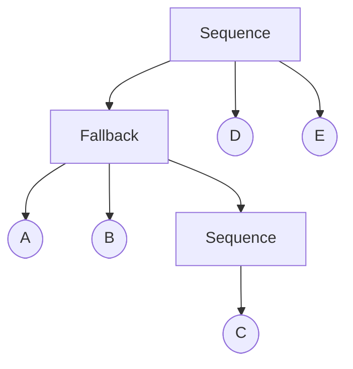

---

### n=8 · seed=1

- **Nodes:** 8 &nbsp;|&nbsp; **Control:** 2 &nbsp;|&nbsp; **Leaves:** 6 &nbsp;|&nbsp; **Edges |E|:** 12 &nbsp;|&nbsp; **Binary vars:** 56

**Node array (LCRS fields):**

| Index | Type | Parent | Child | Sibling |
|-------|------|--------|-------|---------|
| `0` | Sequence | `—` | `1` | `—` |
| `1` | Fallback | `0` | `2` | `5` |
| `2` | Leaf A | `1` | `—` | `3` |
| `3` | Leaf B | `1` | `—` | `4` |
| `4` | Leaf C | `1` | `—` | `—` |
| `5` | Leaf D | `0` | `—` | `6` |
| `6` | Leaf E | `0` | `—` | `7` |
| `7` | Leaf F | `0` | `—` | `—` |

**Behavior tree:**

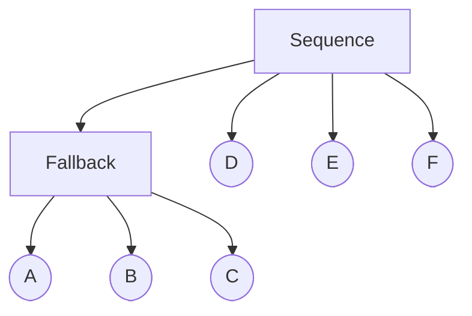

---

### n=8 · seed=2

- **Nodes:** 8 &nbsp;|&nbsp; **Control:** 3 &nbsp;|&nbsp; **Leaves:** 5 &nbsp;|&nbsp; **Edges |E|:** 11 &nbsp;|&nbsp; **Binary vars:** 56

**Node array (LCRS fields):**

| Index | Type | Parent | Child | Sibling |
|-------|------|--------|-------|---------|
| `0` | Sequence | `—` | `1` | `—` |
| `1` | Fallback | `0` | `2` | `7` |
| `2` | Sequence | `1` | `3` | `5` |
| `3` | Leaf A | `2` | `—` | `4` |
| `4` | Leaf B | `2` | `—` | `—` |
| `5` | Leaf C | `1` | `—` | `6` |
| `6` | Leaf D | `1` | `—` | `—` |
| `7` | Leaf E | `0` | `—` | `—` |

**Behavior tree:**

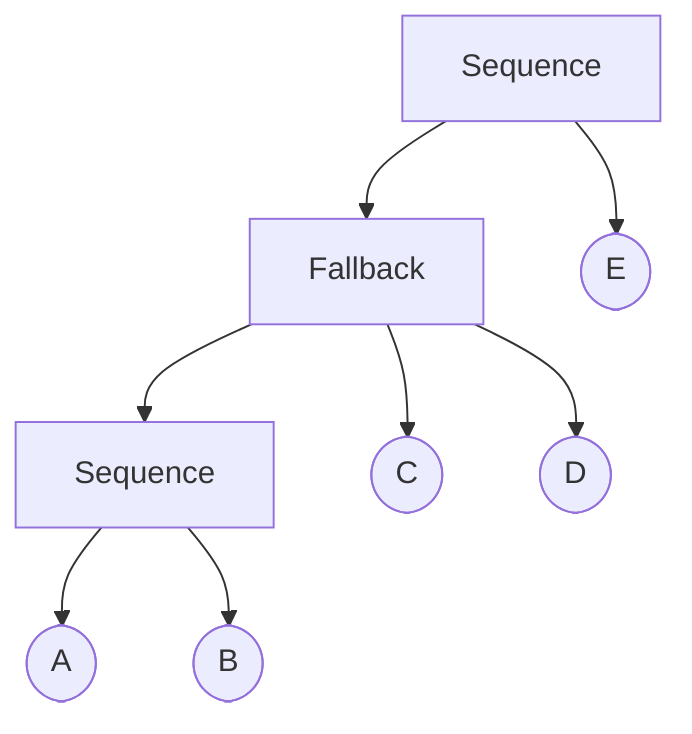

---

### n=8 · seed=3

- **Nodes:** 8 &nbsp;|&nbsp; **Control:** 2 &nbsp;|&nbsp; **Leaves:** 6 &nbsp;|&nbsp; **Edges |E|:** 12 &nbsp;|&nbsp; **Binary vars:** 56

**Node array (LCRS fields):**

| Index | Type | Parent | Child | Sibling |
|-------|------|--------|-------|---------|
| `0` | Sequence | `—` | `1` | `—` |
| `1` | Leaf A | `0` | `—` | `2` |
| `2` | Fallback | `0` | `3` | `6` |
| `3` | Leaf B | `2` | `—` | `4` |
| `4` | Leaf C | `2` | `—` | `5` |
| `5` | Leaf D | `2` | `—` | `—` |
| `6` | Leaf E | `0` | `—` | `7` |
| `7` | Leaf F | `0` | `—` | `—` |

**Behavior tree:**

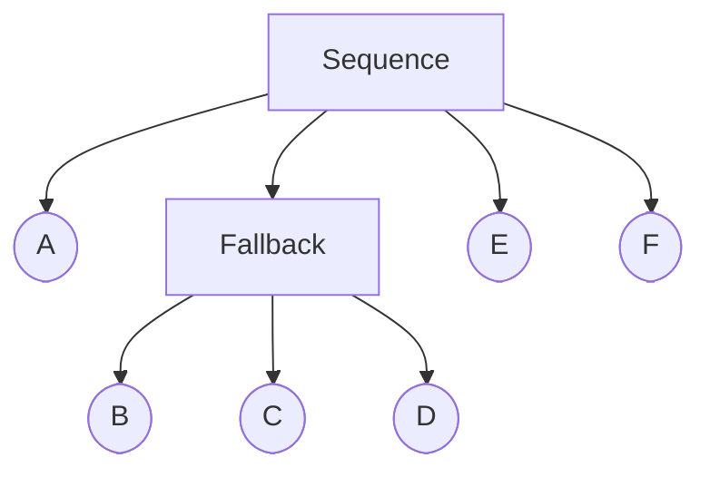

---

### n=8 · seed=4

- **Nodes:** 8 &nbsp;|&nbsp; **Control:** 2 &nbsp;|&nbsp; **Leaves:** 6 &nbsp;|&nbsp; **Edges |E|:** 12 &nbsp;|&nbsp; **Binary vars:** 56

**Node array (LCRS fields):**

| Index | Type | Parent | Child | Sibling |
|-------|------|--------|-------|---------|
| `0` | Sequence | `—` | `1` | `—` |
| `1` | Fallback | `0` | `2` | `6` |
| `2` | Leaf A | `1` | `—` | `3` |
| `3` | Leaf B | `1` | `—` | `4` |
| `4` | Leaf C | `1` | `—` | `5` |
| `5` | Leaf D | `1` | `—` | `—` |
| `6` | Leaf E | `0` | `—` | `7` |
| `7` | Leaf F | `0` | `—` | `—` |

**Behavior tree:**

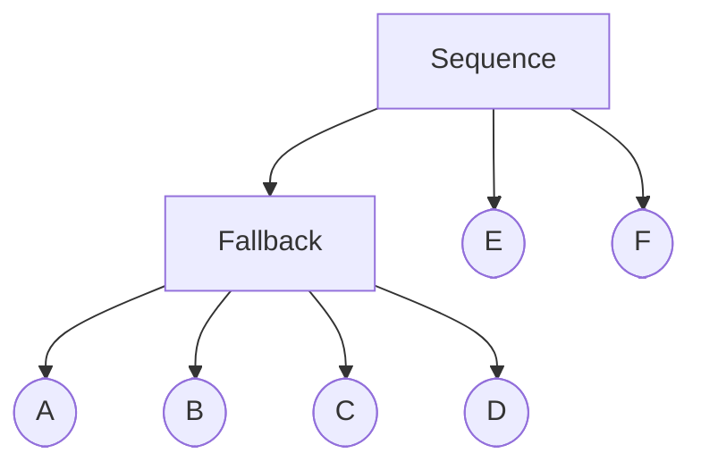

---

## n = 10

### n=10 · seed=0

- **Nodes:** 10 &nbsp;|&nbsp; **Control:** 3 &nbsp;|&nbsp; **Leaves:** 7 &nbsp;|&nbsp; **Edges |E|:** 15 &nbsp;|&nbsp; **Binary vars:** 90

**Node array (LCRS fields):**

| Index | Type | Parent | Child | Sibling |
|-------|------|--------|-------|---------|
| `0` | Sequence | `—` | `1` | `—` |
| `1` | Fallback | `0` | `2` | `8` |
| `2` | Leaf A | `1` | `—` | `3` |
| `3` | Leaf B | `1` | `—` | `4` |
| `4` | Sequence | `1` | `5` | `—` |
| `5` | Leaf C | `4` | `—` | `6` |
| `6` | Leaf D | `4` | `—` | `7` |
| `7` | Leaf E | `4` | `—` | `—` |
| `8` | Leaf F | `0` | `—` | `9` |
| `9` | Leaf G | `0` | `—` | `—` |

**Behavior tree:**

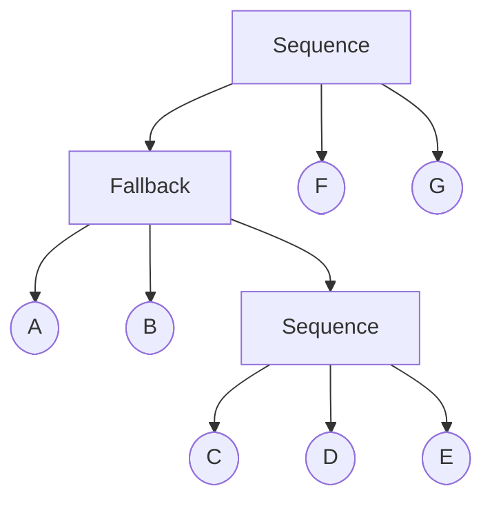

---

### n=10 · seed=1

- **Nodes:** 10 &nbsp;|&nbsp; **Control:** 3 &nbsp;|&nbsp; **Leaves:** 7 &nbsp;|&nbsp; **Edges |E|:** 15 &nbsp;|&nbsp; **Binary vars:** 90

**Node array (LCRS fields):**

| Index | Type | Parent | Child | Sibling |
|-------|------|--------|-------|---------|
| `0` | Sequence | `—` | `1` | `—` |
| `1` | Fallback | `0` | `2` | `5` |
| `2` | Leaf A | `1` | `—` | `3` |
| `3` | Leaf B | `1` | `—` | `4` |
| `4` | Leaf C | `1` | `—` | `—` |
| `5` | Sequence | `0` | `6` | `8` |
| `6` | Leaf D | `5` | `—` | `7` |
| `7` | Leaf E | `5` | `—` | `—` |
| `8` | Leaf F | `0` | `—` | `9` |
| `9` | Leaf G | `0` | `—` | `—` |

**Behavior tree:**

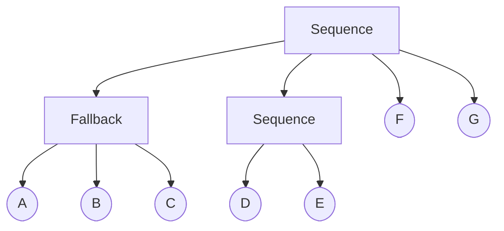

---

### n=10 · seed=2

- **Nodes:** 10 &nbsp;|&nbsp; **Control:** 3 &nbsp;|&nbsp; **Leaves:** 7 &nbsp;|&nbsp; **Edges |E|:** 15 &nbsp;|&nbsp; **Binary vars:** 90

**Node array (LCRS fields):**

| Index | Type | Parent | Child | Sibling |
|-------|------|--------|-------|---------|
| `0` | Sequence | `—` | `1` | `—` |
| `1` | Fallback | `0` | `2` | `9` |
| `2` | Sequence | `1` | `3` | `7` |
| `3` | Leaf A | `2` | `—` | `4` |
| `4` | Leaf B | `2` | `—` | `5` |
| `5` | Leaf C | `2` | `—` | `6` |
| `6` | Leaf D | `2` | `—` | `—` |
| `7` | Leaf E | `1` | `—` | `8` |
| `8` | Leaf F | `1` | `—` | `—` |
| `9` | Leaf G | `0` | `—` | `—` |

**Behavior tree:**

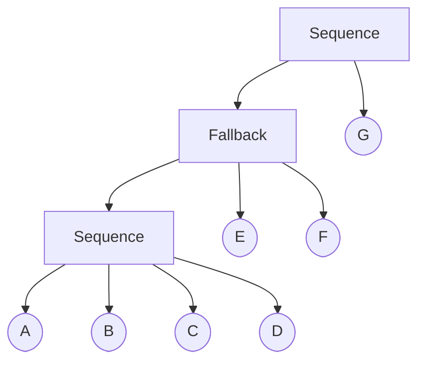

---

### n=10 · seed=3

- **Nodes:** 10 &nbsp;|&nbsp; **Control:** 3 &nbsp;|&nbsp; **Leaves:** 7 &nbsp;|&nbsp; **Edges |E|:** 15 &nbsp;|&nbsp; **Binary vars:** 90

**Node array (LCRS fields):**

| Index | Type | Parent | Child | Sibling |
|-------|------|--------|-------|---------|
| `0` | Sequence | `—` | `1` | `—` |
| `1` | Leaf A | `0` | `—` | `2` |
| `2` | Fallback | `0` | `3` | `8` |
| `3` | Leaf B | `2` | `—` | `4` |
| `4` | Sequence | `2` | `5` | `7` |
| `5` | Leaf C | `4` | `—` | `6` |
| `6` | Leaf D | `4` | `—` | `—` |
| `7` | Leaf E | `2` | `—` | `—` |
| `8` | Leaf F | `0` | `—` | `9` |
| `9` | Leaf G | `0` | `—` | `—` |

**Behavior tree:**

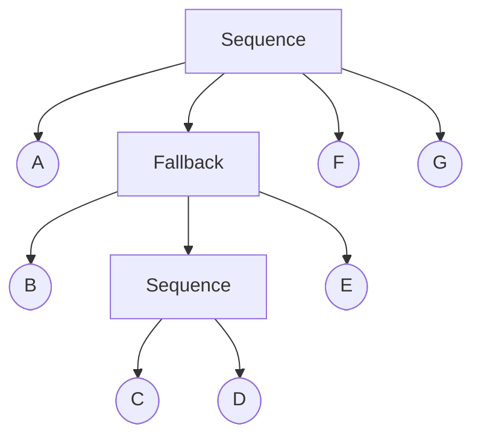

---

### n=10 · seed=4

- **Nodes:** 10 &nbsp;|&nbsp; **Control:** 3 &nbsp;|&nbsp; **Leaves:** 7 &nbsp;|&nbsp; **Edges |E|:** 15 &nbsp;|&nbsp; **Binary vars:** 90

**Node array (LCRS fields):**

| Index | Type | Parent | Child | Sibling |
|-------|------|--------|-------|---------|
| `0` | Sequence | `—` | `1` | `—` |
| `1` | Fallback | `0` | `2` | `8` |
| `2` | Leaf A | `1` | `—` | `3` |
| `3` | Sequence | `1` | `4` | `6` |
| `4` | Leaf B | `3` | `—` | `5` |
| `5` | Leaf C | `3` | `—` | `—` |
| `6` | Leaf D | `1` | `—` | `7` |
| `7` | Leaf E | `1` | `—` | `—` |
| `8` | Leaf F | `0` | `—` | `9` |
| `9` | Leaf G | `0` | `—` | `—` |

**Behavior tree:**

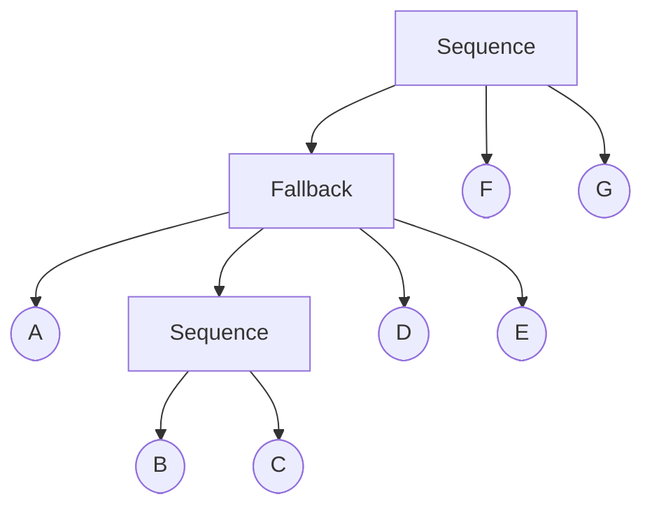

---

## n = 12

### n=12 · seed=0

- **Nodes:** 12 &nbsp;|&nbsp; **Control:** 4 &nbsp;|&nbsp; **Leaves:** 8 &nbsp;|&nbsp; **Edges |E|:** 18 &nbsp;|&nbsp; **Binary vars:** 132

**Node array (LCRS fields):**

| Index | Type | Parent | Child | Sibling |
|-------|------|--------|-------|---------|
| `0` | Sequence | `—` | `1` | `—` |
| `1` | Fallback | `0` | `2` | `10` |
| `2` | Leaf A | `1` | `—` | `3` |
| `3` | Sequence | `1` | `4` | `6` |
| `4` | Leaf B | `3` | `—` | `5` |
| `5` | Leaf C | `3` | `—` | `—` |
| `6` | Fallback | `1` | `7` | `—` |
| `7` | Leaf D | `6` | `—` | `8` |
| `8` | Leaf E | `6` | `—` | `9` |
| `9` | Leaf F | `6` | `—` | `—` |
| `10` | Leaf G | `0` | `—` | `11` |
| `11` | Leaf H | `0` | `—` | `—` |

**Behavior tree:**

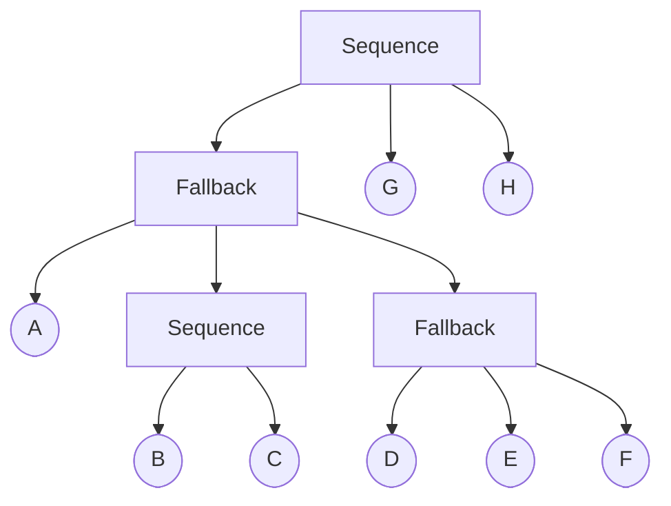

---

### n=12 · seed=1

- **Nodes:** 12 &nbsp;|&nbsp; **Control:** 4 &nbsp;|&nbsp; **Leaves:** 8 &nbsp;|&nbsp; **Edges |E|:** 18 &nbsp;|&nbsp; **Binary vars:** 132

**Node array (LCRS fields):**

| Index | Type | Parent | Child | Sibling |
|-------|------|--------|-------|---------|
| `0` | Sequence | `—` | `1` | `—` |
| `1` | Fallback | `0` | `2` | `5` |
| `2` | Leaf A | `1` | `—` | `3` |
| `3` | Leaf B | `1` | `—` | `4` |
| `4` | Leaf C | `1` | `—` | `—` |
| `5` | Sequence | `0` | `6` | `10` |
| `6` | Leaf D | `5` | `—` | `7` |
| `7` | Leaf E | `5` | `—` | `8` |
| `8` | Fallback | `5` | `9` | `—` |
| `9` | Leaf F | `8` | `—` | `—` |
| `10` | Leaf G | `0` | `—` | `11` |
| `11` | Leaf H | `0` | `—` | `—` |

**Behavior tree:**

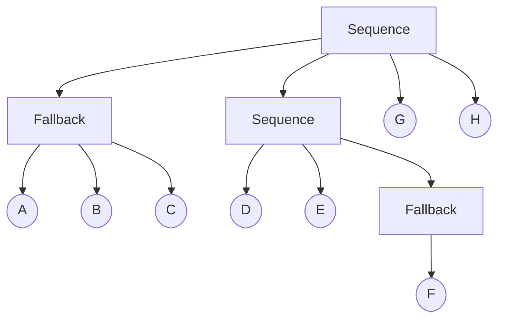

---

### n=12 · seed=2

- **Nodes:** 12 &nbsp;|&nbsp; **Control:** 4 &nbsp;|&nbsp; **Leaves:** 8 &nbsp;|&nbsp; **Edges |E|:** 18 &nbsp;|&nbsp; **Binary vars:** 132

**Node array (LCRS fields):**

| Index | Type | Parent | Child | Sibling |
|-------|------|--------|-------|---------|
| `0` | Sequence | `—` | `1` | `—` |
| `1` | Fallback | `0` | `2` | `11` |
| `2` | Sequence | `1` | `3` | `9` |
| `3` | Leaf A | `2` | `—` | `4` |
| `4` | Leaf B | `2` | `—` | `5` |
| `5` | Leaf C | `2` | `—` | `6` |
| `6` | Fallback | `2` | `7` | `—` |
| `7` | Leaf D | `6` | `—` | `8` |
| `8` | Leaf E | `6` | `—` | `—` |
| `9` | Leaf F | `1` | `—` | `10` |
| `10` | Leaf G | `1` | `—` | `—` |
| `11` | Leaf H | `0` | `—` | `—` |

**Behavior tree:**

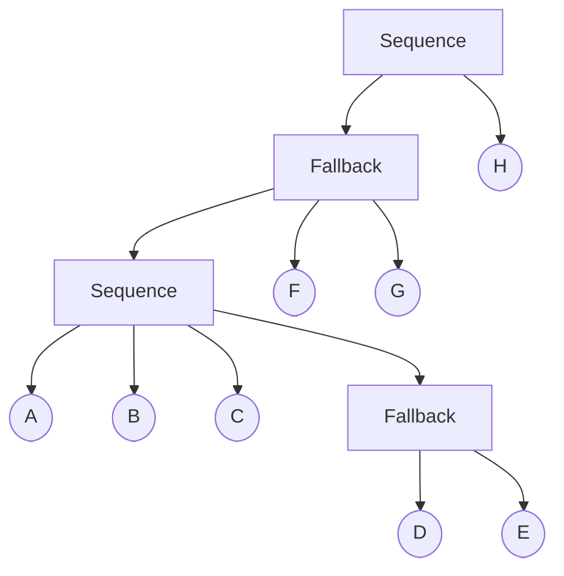

---

### n=12 · seed=3

- **Nodes:** 12 &nbsp;|&nbsp; **Control:** 4 &nbsp;|&nbsp; **Leaves:** 8 &nbsp;|&nbsp; **Edges |E|:** 18 &nbsp;|&nbsp; **Binary vars:** 132

**Node array (LCRS fields):**

| Index | Type | Parent | Child | Sibling |
|-------|------|--------|-------|---------|
| `0` | Sequence | `—` | `1` | `—` |
| `1` | Leaf A | `0` | `—` | `2` |
| `2` | Fallback | `0` | `3` | `9` |
| `3` | Leaf B | `2` | `—` | `4` |
| `4` | Sequence | `2` | `5` | `8` |
| `5` | Leaf C | `4` | `—` | `6` |
| `6` | Leaf D | `4` | `—` | `7` |
| `7` | Leaf E | `4` | `—` | `—` |
| `8` | Leaf F | `2` | `—` | `—` |
| `9` | Fallback | `0` | `10` | `11` |
| `10` | Leaf G | `9` | `—` | `—` |
| `11` | Leaf H | `0` | `—` | `—` |

**Behavior tree:**

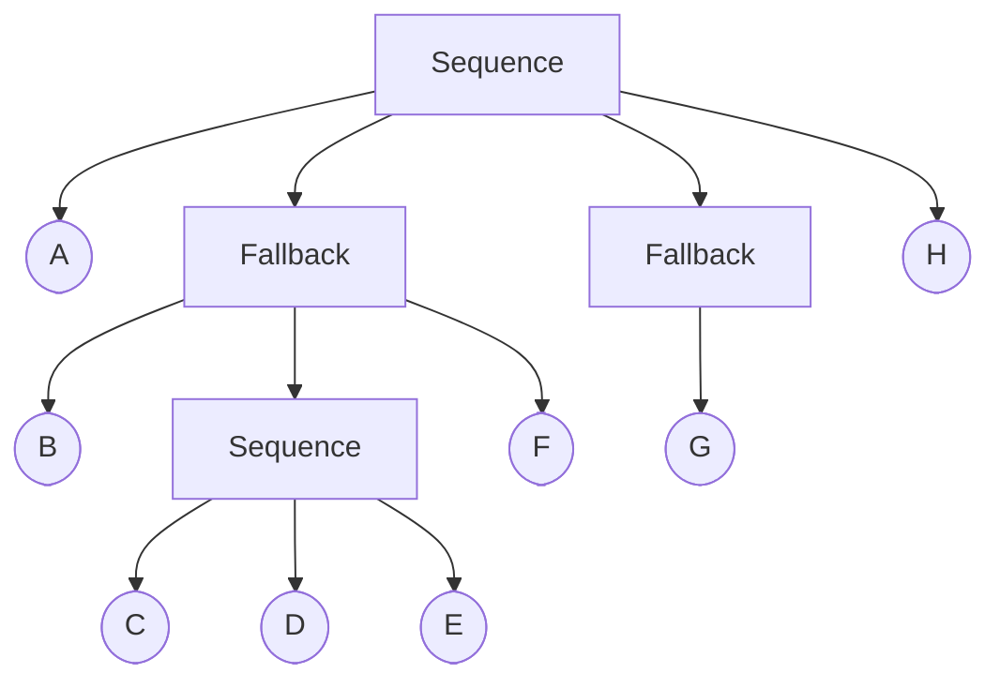

---

### n=12 · seed=4

- **Nodes:** 12 &nbsp;|&nbsp; **Control:** 4 &nbsp;|&nbsp; **Leaves:** 8 &nbsp;|&nbsp; **Edges |E|:** 18 &nbsp;|&nbsp; **Binary vars:** 132

**Node array (LCRS fields):**

| Index | Type | Parent | Child | Sibling |
|-------|------|--------|-------|---------|
| `0` | Sequence | `—` | `1` | `—` |
| `1` | Fallback | `0` | `2` | `10` |
| `2` | Sequence | `1` | `3` | `4` |
| `3` | Leaf A | `2` | `—` | `—` |
| `4` | Fallback | `1` | `5` | `8` |
| `5` | Leaf B | `4` | `—` | `6` |
| `6` | Leaf C | `4` | `—` | `7` |
| `7` | Leaf D | `4` | `—` | `—` |
| `8` | Leaf E | `1` | `—` | `9` |
| `9` | Leaf F | `1` | `—` | `—` |
| `10` | Leaf G | `0` | `—` | `11` |
| `11` | Leaf H | `0` | `—` | `—` |

**Behavior tree:**

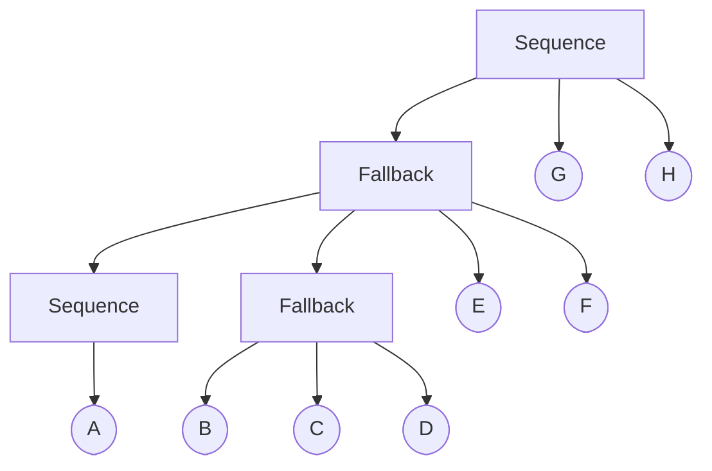

---

## n = 15

### n=15 · seed=0

- **Nodes:** 15 &nbsp;|&nbsp; **Control:** 5 &nbsp;|&nbsp; **Leaves:** 10 &nbsp;|&nbsp; **Edges |E|:** 23 &nbsp;|&nbsp; **Binary vars:** 210

**Node array (LCRS fields):**

| Index | Type | Parent | Child | Sibling |
|-------|------|--------|-------|---------|
| `0` | Sequence | `—` | `1` | `—` |
| `1` | Fallback | `0` | `2` | `13` |
| `2` | Leaf A | `1` | `—` | `3` |
| `3` | Sequence | `1` | `4` | `9` |
| `4` | Leaf B | `3` | `—` | `5` |
| `5` | Fallback | `3` | `6` | `8` |
| `6` | Leaf C | `5` | `—` | `7` |
| `7` | Leaf D | `5` | `—` | `—` |
| `8` | Leaf E | `3` | `—` | `—` |
| `9` | Sequence | `1` | `10` | `—` |
| `10` | Leaf F | `9` | `—` | `11` |
| `11` | Leaf G | `9` | `—` | `12` |
| `12` | Leaf H | `9` | `—` | `—` |
| `13` | Leaf I | `0` | `—` | `14` |
| `14` | Leaf J | `0` | `—` | `—` |

**Behavior tree:**

```mermaid
graph TD
    N0["Sequence"]
    N1["Fallback"]
    N2(["A"])
    N3["Sequence"]
    N4(["B"])
    N5["Fallback"]
    N6(["C"])
    N7(["D"])
    N8(["E"])
    N9["Sequence"]
    N10(["F"])
    N11(["G"])
    N12(["H"])
    N13(["I"])
    N14(["J"])

    N0 --> N1
    N0 --> N13
    N0 --> N14
    N1 --> N2
    N1 --> N3
    N1 --> N9
    N3 --> N4
    N3 --> N5
    N3 --> N8
    N5 --> N6
    N5 --> N7
    N9 --> N10
    N9 --> N11
    N9 --> N12
```

---

### n=15 · seed=1

- **Nodes:** 15 &nbsp;|&nbsp; **Control:** 5 &nbsp;|&nbsp; **Leaves:** 10 &nbsp;|&nbsp; **Edges |E|:** 23 &nbsp;|&nbsp; **Binary vars:** 210

**Node array (LCRS fields):**

| Index | Type | Parent | Child | Sibling |
|-------|------|--------|-------|---------|
| `0` | Sequence | `—` | `1` | `—` |
| `1` | Fallback | `0` | `2` | `5` |
| `2` | Leaf A | `1` | `—` | `3` |
| `3` | Leaf B | `1` | `—` | `4` |
| `4` | Leaf C | `1` | `—` | `—` |
| `5` | Sequence | `0` | `6` | `13` |
| `6` | Leaf D | `5` | `—` | `7` |
| `7` | Fallback | `5` | `8` | `9` |
| `8` | Leaf E | `7` | `—` | `—` |
| `9` | Sequence | `5` | `10` | `—` |
| `10` | Leaf F | `9` | `—` | `11` |
| `11` | Leaf G | `9` | `—` | `12` |
| `12` | Leaf H | `9` | `—` | `—` |
| `13` | Leaf I | `0` | `—` | `14` |
| `14` | Leaf J | `0` | `—` | `—` |

**Behavior tree:**

```mermaid
graph TD
    N0["Sequence"]
    N1["Fallback"]
    N2(["A"])
    N3(["B"])
    N4(["C"])
    N5["Sequence"]
    N6(["D"])
    N7["Fallback"]
    N8(["E"])
    N9["Sequence"]
    N10(["F"])
    N11(["G"])
    N12(["H"])
    N13(["I"])
    N14(["J"])

    N0 --> N1
    N0 --> N5
    N0 --> N13
    N0 --> N14
    N1 --> N2
    N1 --> N3
    N1 --> N4
    N5 --> N6
    N5 --> N7
    N5 --> N9
    N7 --> N8
    N9 --> N10
    N9 --> N11
    N9 --> N12
```

---

### n=15 · seed=2

- **Nodes:** 15 &nbsp;|&nbsp; **Control:** 5 &nbsp;|&nbsp; **Leaves:** 10 &nbsp;|&nbsp; **Edges |E|:** 23 &nbsp;|&nbsp; **Binary vars:** 210

**Node array (LCRS fields):**

| Index | Type | Parent | Child | Sibling |
|-------|------|--------|-------|---------|
| `0` | Sequence | `—` | `1` | `—` |
| `1` | Fallback | `0` | `2` | `14` |
| `2` | Sequence | `1` | `3` | `12` |
| `3` | Leaf A | `2` | `—` | `4` |
| `4` | Fallback | `2` | `5` | `6` |
| `5` | Leaf B | `4` | `—` | `—` |
| `6` | Leaf C | `2` | `—` | `7` |
| `7` | Sequence | `2` | `8` | `—` |
| `8` | Leaf D | `7` | `—` | `9` |
| `9` | Leaf E | `7` | `—` | `10` |
| `10` | Leaf F | `7` | `—` | `11` |
| `11` | Leaf G | `7` | `—` | `—` |
| `12` | Leaf H | `1` | `—` | `13` |
| `13` | Leaf I | `1` | `—` | `—` |
| `14` | Leaf J | `0` | `—` | `—` |

**Behavior tree:**

```mermaid
graph TD
    N0["Sequence"]
    N1["Fallback"]
    N2["Sequence"]
    N3(["A"])
    N4["Fallback"]
    N5(["B"])
    N6(["C"])
    N7["Sequence"]
    N8(["D"])
    N9(["E"])
    N10(["F"])
    N11(["G"])
    N12(["H"])
    N13(["I"])
    N14(["J"])

    N0 --> N1
    N0 --> N14
    N1 --> N2
    N1 --> N12
    N1 --> N13
    N2 --> N3
    N2 --> N4
    N2 --> N6
    N2 --> N7
    N4 --> N5
    N7 --> N8
    N7 --> N9
    N7 --> N10
    N7 --> N11
```

---

### n=15 · seed=3

- **Nodes:** 15 &nbsp;|&nbsp; **Control:** 4 &nbsp;|&nbsp; **Leaves:** 11 &nbsp;|&nbsp; **Edges |E|:** 24 &nbsp;|&nbsp; **Binary vars:** 210

**Node array (LCRS fields):**

| Index | Type | Parent | Child | Sibling |
|-------|------|--------|-------|---------|
| `0` | Sequence | `—` | `1` | `—` |
| `1` | Leaf A | `0` | `—` | `2` |
| `2` | Fallback | `0` | `3` | `9` |
| `3` | Leaf B | `2` | `—` | `4` |
| `4` | Sequence | `2` | `5` | `8` |
| `5` | Leaf C | `4` | `—` | `6` |
| `6` | Leaf D | `4` | `—` | `7` |
| `7` | Leaf E | `4` | `—` | `—` |
| `8` | Leaf F | `2` | `—` | `—` |
| `9` | Fallback | `0` | `10` | `14` |
| `10` | Leaf G | `9` | `—` | `11` |
| `11` | Leaf H | `9` | `—` | `12` |
| `12` | Leaf I | `9` | `—` | `13` |
| `13` | Leaf J | `9` | `—` | `—` |
| `14` | Leaf K | `0` | `—` | `—` |

**Behavior tree:**

```mermaid
graph TD
    N0["Sequence"]
    N1(["A"])
    N2["Fallback"]
    N3(["B"])
    N4["Sequence"]
    N5(["C"])
    N6(["D"])
    N7(["E"])
    N8(["F"])
    N9["Fallback"]
    N10(["G"])
    N11(["H"])
    N12(["I"])
    N13(["J"])
    N14(["K"])

    N0 --> N1
    N0 --> N2
    N0 --> N9
    N0 --> N14
    N2 --> N3
    N2 --> N4
    N2 --> N8
    N4 --> N5
    N4 --> N6
    N4 --> N7
    N9 --> N10
    N9 --> N11
    N9 --> N12
    N9 --> N13
```

---

### n=15 · seed=4

- **Nodes:** 15 &nbsp;|&nbsp; **Control:** 5 &nbsp;|&nbsp; **Leaves:** 10 &nbsp;|&nbsp; **Edges |E|:** 23 &nbsp;|&nbsp; **Binary vars:** 210

**Node array (LCRS fields):**

| Index | Type | Parent | Child | Sibling |
|-------|------|--------|-------|---------|
| `0` | Sequence | `—` | `1` | `—` |
| `1` | Fallback | `0` | `2` | `11` |
| `2` | Sequence | `1` | `3` | `5` |
| `3` | Leaf A | `2` | `—` | `4` |
| `4` | Leaf B | `2` | `—` | `—` |
| `5` | Fallback | `1` | `6` | `9` |
| `6` | Leaf C | `5` | `—` | `7` |
| `7` | Leaf D | `5` | `—` | `8` |
| `8` | Leaf E | `5` | `—` | `—` |
| `9` | Leaf F | `1` | `—` | `10` |
| `10` | Leaf G | `1` | `—` | `—` |
| `11` | Leaf H | `0` | `—` | `12` |
| `12` | Sequence | `0` | `13` | `—` |
| `13` | Leaf I | `12` | `—` | `14` |
| `14` | Leaf J | `12` | `—` | `—` |

**Behavior tree:**

```mermaid
graph TD
    N0["Sequence"]
    N1["Fallback"]
    N2["Sequence"]
    N3(["A"])
    N4(["B"])
    N5["Fallback"]
    N6(["C"])
    N7(["D"])
    N8(["E"])
    N9(["F"])
    N10(["G"])
    N11(["H"])
    N12["Sequence"]
    N13(["I"])
    N14(["J"])

    N0 --> N1
    N0 --> N11
    N0 --> N12
    N1 --> N2
    N1 --> N5
    N1 --> N9
    N1 --> N10
    N2 --> N3
    N2 --> N4
    N5 --> N6
    N5 --> N7
    N5 --> N8
    N12 --> N13
    N12 --> N14
```

---

## n = 20

### n=20 · seed=0

- **Nodes:** 20 &nbsp;|&nbsp; **Control:** 7 &nbsp;|&nbsp; **Leaves:** 13 &nbsp;|&nbsp; **Edges |E|:** 31 &nbsp;|&nbsp; **Binary vars:** 380

**Node array (LCRS fields):**

| Index | Type | Parent | Child | Sibling |
|-------|------|--------|-------|---------|
| `0` | Sequence | `—` | `1` | `—` |
| `1` | Fallback | `0` | `2` | `18` |
| `2` | Leaf A | `1` | `—` | `3` |
| `3` | Sequence | `1` | `4` | `14` |
| `4` | Leaf B | `3` | `—` | `5` |
| `5` | Fallback | `3` | `6` | `13` |
| `6` | Sequence | `5` | `7` | `9` |
| `7` | Leaf C | `6` | `—` | `8` |
| `8` | Leaf D | `6` | `—` | `—` |
| `9` | Fallback | `5` | `10` | `12` |
| `10` | Leaf E | `9` | `—` | `11` |
| `11` | Leaf F | `9` | `—` | `—` |
| `12` | Leaf G | `5` | `—` | `—` |
| `13` | Leaf H | `3` | `—` | `—` |
| `14` | Sequence | `1` | `15` | `—` |
| `15` | Leaf I | `14` | `—` | `16` |
| `16` | Leaf J | `14` | `—` | `17` |
| `17` | Leaf K | `14` | `—` | `—` |
| `18` | Leaf L | `0` | `—` | `19` |
| `19` | Leaf M | `0` | `—` | `—` |

**Behavior tree:**

```mermaid
graph TD
    N0["Sequence"]
    N1["Fallback"]
    N2(["A"])
    N3["Sequence"]
    N4(["B"])
    N5["Fallback"]
    N6["Sequence"]
    N7(["C"])
    N8(["D"])
    N9["Fallback"]
    N10(["E"])
    N11(["F"])
    N12(["G"])
    N13(["H"])
    N14["Sequence"]
    N15(["I"])
    N16(["J"])
    N17(["K"])
    N18(["L"])
    N19(["M"])

    N0 --> N1
    N0 --> N18
    N0 --> N19
    N1 --> N2
    N1 --> N3
    N1 --> N14
    N3 --> N4
    N3 --> N5
    N3 --> N13
    N5 --> N6
    N5 --> N9
    N5 --> N12
    N6 --> N7
    N6 --> N8
    N9 --> N10
    N9 --> N11
    N14 --> N15
    N14 --> N16
    N14 --> N17
```

---

### n=20 · seed=1

- **Nodes:** 20 &nbsp;|&nbsp; **Control:** 7 &nbsp;|&nbsp; **Leaves:** 13 &nbsp;|&nbsp; **Edges |E|:** 31 &nbsp;|&nbsp; **Binary vars:** 380

**Node array (LCRS fields):**

| Index | Type | Parent | Child | Sibling |
|-------|------|--------|-------|---------|
| `0` | Sequence | `—` | `1` | `—` |
| `1` | Fallback | `0` | `2` | `5` |
| `2` | Leaf A | `1` | `—` | `3` |
| `3` | Leaf B | `1` | `—` | `4` |
| `4` | Leaf C | `1` | `—` | `—` |
| `5` | Sequence | `0` | `6` | `14` |
| `6` | Leaf D | `5` | `—` | `7` |
| `7` | Fallback | `5` | `8` | `10` |
| `8` | Leaf E | `7` | `—` | `9` |
| `9` | Leaf F | `7` | `—` | `—` |
| `10` | Sequence | `5` | `11` | `—` |
| `11` | Leaf G | `10` | `—` | `12` |
| `12` | Leaf H | `10` | `—` | `13` |
| `13` | Leaf I | `10` | `—` | `—` |
| `14` | Fallback | `0` | `15` | `16` |
| `15` | Leaf J | `14` | `—` | `—` |
| `16` | Sequence | `0` | `17` | `—` |
| `17` | Leaf K | `16` | `—` | `18` |
| `18` | Leaf L | `16` | `—` | `19` |
| `19` | Leaf M | `16` | `—` | `—` |

**Behavior tree:**

```mermaid
graph TD
    N0["Sequence"]
    N1["Fallback"]
    N2(["A"])
    N3(["B"])
    N4(["C"])
    N5["Sequence"]
    N6(["D"])
    N7["Fallback"]
    N8(["E"])
    N9(["F"])
    N10["Sequence"]
    N11(["G"])
    N12(["H"])
    N13(["I"])
    N14["Fallback"]
    N15(["J"])
    N16["Sequence"]
    N17(["K"])
    N18(["L"])
    N19(["M"])

    N0 --> N1
    N0 --> N5
    N0 --> N14
    N0 --> N16
    N1 --> N2
    N1 --> N3
    N1 --> N4
    N5 --> N6
    N5 --> N7
    N5 --> N10
    N7 --> N8
    N7 --> N9
    N10 --> N11
    N10 --> N12
    N10 --> N13
    N14 --> N15
    N16 --> N17
    N16 --> N18
    N16 --> N19
```

---

### n=20 · seed=2

- **Nodes:** 20 &nbsp;|&nbsp; **Control:** 7 &nbsp;|&nbsp; **Leaves:** 13 &nbsp;|&nbsp; **Edges |E|:** 31 &nbsp;|&nbsp; **Binary vars:** 380

**Node array (LCRS fields):**

| Index | Type | Parent | Child | Sibling |
|-------|------|--------|-------|---------|
| `0` | Sequence | `—` | `1` | `—` |
| `1` | Fallback | `0` | `2` | `19` |
| `2` | Sequence | `1` | `3` | `17` |
| `3` | Leaf A | `2` | `—` | `4` |
| `4` | Fallback | `2` | `5` | `11` |
| `5` | Sequence | `4` | `6` | `8` |
| `6` | Leaf B | `5` | `—` | `7` |
| `7` | Leaf C | `5` | `—` | `—` |
| `8` | Fallback | `4` | `9` | `10` |
| `9` | Leaf D | `8` | `—` | `—` |
| `10` | Leaf E | `4` | `—` | `—` |
| `11` | Leaf F | `2` | `—` | `12` |
| `12` | Sequence | `2` | `13` | `—` |
| `13` | Leaf G | `12` | `—` | `14` |
| `14` | Leaf H | `12` | `—` | `15` |
| `15` | Leaf I | `12` | `—` | `16` |
| `16` | Leaf J | `12` | `—` | `—` |
| `17` | Leaf K | `1` | `—` | `18` |
| `18` | Leaf L | `1` | `—` | `—` |
| `19` | Leaf M | `0` | `—` | `—` |

**Behavior tree:**

```mermaid
graph TD
    N0["Sequence"]
    N1["Fallback"]
    N2["Sequence"]
    N3(["A"])
    N4["Fallback"]
    N5["Sequence"]
    N6(["B"])
    N7(["C"])
    N8["Fallback"]
    N9(["D"])
    N10(["E"])
    N11(["F"])
    N12["Sequence"]
    N13(["G"])
    N14(["H"])
    N15(["I"])
    N16(["J"])
    N17(["K"])
    N18(["L"])
    N19(["M"])

    N0 --> N1
    N0 --> N19
    N1 --> N2
    N1 --> N17
    N1 --> N18
    N2 --> N3
    N2 --> N4
    N2 --> N11
    N2 --> N12
    N4 --> N5
    N4 --> N8
    N4 --> N10
    N5 --> N6
    N5 --> N7
    N8 --> N9
    N12 --> N13
    N12 --> N14
    N12 --> N15
    N12 --> N16
```

---

### n=20 · seed=3

- **Nodes:** 20 &nbsp;|&nbsp; **Control:** 6 &nbsp;|&nbsp; **Leaves:** 14 &nbsp;|&nbsp; **Edges |E|:** 32 &nbsp;|&nbsp; **Binary vars:** 380

**Node array (LCRS fields):**

| Index | Type | Parent | Child | Sibling |
|-------|------|--------|-------|---------|
| `0` | Sequence | `—` | `1` | `—` |
| `1` | Fallback | `0` | `2` | `5` |
| `2` | Leaf A | `1` | `—` | `3` |
| `3` | Leaf B | `1` | `—` | `4` |
| `4` | Leaf C | `1` | `—` | `—` |
| `5` | Sequence | `0` | `6` | `14` |
| `6` | Leaf D | `5` | `—` | `7` |
| `7` | Fallback | `5` | `8` | `13` |
| `8` | Leaf E | `7` | `—` | `9` |
| `9` | Sequence | `7` | `10` | `12` |
| `10` | Leaf F | `9` | `—` | `11` |
| `11` | Leaf G | `9` | `—` | `—` |
| `12` | Leaf H | `7` | `—` | `—` |
| `13` | Leaf I | `5` | `—` | `—` |
| `14` | Fallback | `0` | `15` | `19` |
| `15` | Leaf J | `14` | `—` | `16` |
| `16` | Leaf K | `14` | `—` | `17` |
| `17` | Leaf L | `14` | `—` | `18` |
| `18` | Leaf M | `14` | `—` | `—` |
| `19` | Leaf N | `0` | `—` | `—` |

**Behavior tree:**

```mermaid
graph TD
    N0["Sequence"]
    N1["Fallback"]
    N2(["A"])
    N3(["B"])
    N4(["C"])
    N5["Sequence"]
    N6(["D"])
    N7["Fallback"]
    N8(["E"])
    N9["Sequence"]
    N10(["F"])
    N11(["G"])
    N12(["H"])
    N13(["I"])
    N14["Fallback"]
    N15(["J"])
    N16(["K"])
    N17(["L"])
    N18(["M"])
    N19(["N"])

    N0 --> N1
    N0 --> N5
    N0 --> N14
    N0 --> N19
    N1 --> N2
    N1 --> N3
    N1 --> N4
    N5 --> N6
    N5 --> N7
    N5 --> N13
    N7 --> N8
    N7 --> N9
    N7 --> N12
    N9 --> N10
    N9 --> N11
    N14 --> N15
    N14 --> N16
    N14 --> N17
    N14 --> N18
```

---

### n=20 · seed=4

- **Nodes:** 20 &nbsp;|&nbsp; **Control:** 7 &nbsp;|&nbsp; **Leaves:** 13 &nbsp;|&nbsp; **Edges |E|:** 31 &nbsp;|&nbsp; **Binary vars:** 380

**Node array (LCRS fields):**

| Index | Type | Parent | Child | Sibling |
|-------|------|--------|-------|---------|
| `0` | Sequence | `—` | `1` | `—` |
| `1` | Fallback | `0` | `2` | `16` |
| `2` | Sequence | `1` | `3` | `9` |
| `3` | Fallback | `2` | `4` | `8` |
| `4` | Leaf A | `3` | `—` | `5` |
| `5` | Leaf B | `3` | `—` | `6` |
| `6` | Leaf C | `3` | `—` | `7` |
| `7` | Leaf D | `3` | `—` | `—` |
| `8` | Leaf E | `2` | `—` | `—` |
| `9` | Sequence | `1` | `10` | `14` |
| `10` | Leaf F | `9` | `—` | `11` |
| `11` | Fallback | `9` | `12` | `13` |
| `12` | Leaf G | `11` | `—` | `—` |
| `13` | Leaf H | `9` | `—` | `—` |
| `14` | Leaf I | `1` | `—` | `15` |
| `15` | Leaf J | `1` | `—` | `—` |
| `16` | Leaf K | `0` | `—` | `17` |
| `17` | Sequence | `0` | `18` | `—` |
| `18` | Leaf L | `17` | `—` | `19` |
| `19` | Leaf M | `17` | `—` | `—` |

**Behavior tree:**

```mermaid
graph TD
    N0["Sequence"]
    N1["Fallback"]
    N2["Sequence"]
    N3["Fallback"]
    N4(["A"])
    N5(["B"])
    N6(["C"])
    N7(["D"])
    N8(["E"])
    N9["Sequence"]
    N10(["F"])
    N11["Fallback"]
    N12(["G"])
    N13(["H"])
    N14(["I"])
    N15(["J"])
    N16(["K"])
    N17["Sequence"]
    N18(["L"])
    N19(["M"])

    N0 --> N1
    N0 --> N16
    N0 --> N17
    N1 --> N2
    N1 --> N9
    N1 --> N14
    N1 --> N15
    N2 --> N3
    N2 --> N8
    N3 --> N4
    N3 --> N5
    N3 --> N6
    N3 --> N7
    N9 --> N10
    N9 --> N11
    N9 --> N13
    N11 --> N12
    N17 --> N18
    N17 --> N19
```

---
